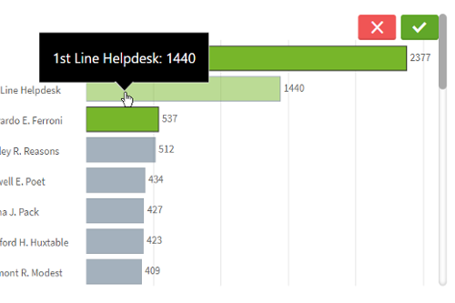
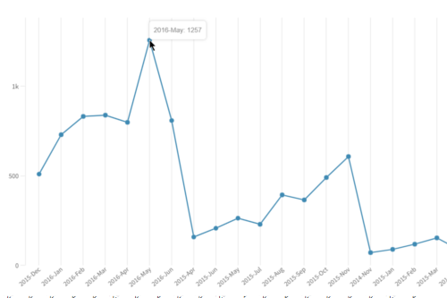
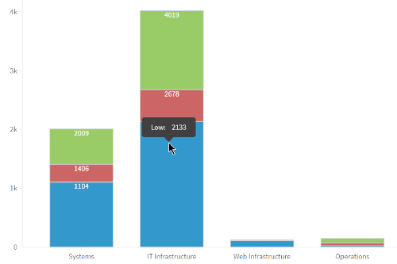
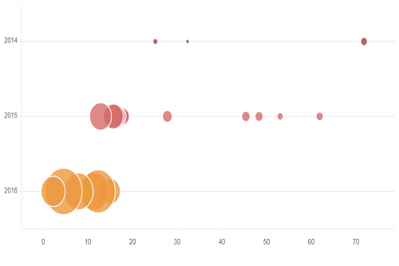
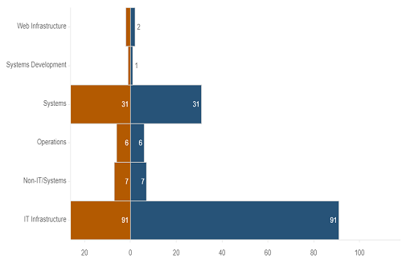

<a id="top"></a>

# QdtPicasso


Create a chart in [Picasso.js](https://picassojs.com/) using the Engine API ([Nov 2019 docs](https://help.qlik.com/en-US/sense-developer/November2019/APIs/EngineAPI/index.html)) in:
 - [Vanilla JavaScript](#vanilla-javascript)
 - [React](#react-jsx)
 - [Angular](#angular)

### Properties

| prop             | type          | description   |
| :---: | :---: | :--- |
| type             | String        | `comboLineBarchart`, `horizontalBarchart`, `lineChart`, `multiLineChart`, `pie`, `piechart`, `pointDistribution`, `pyramid`, `rangeArea`, `scatterplot`, `stackedBarchart`,  `verticalBarchart`, `verticalGauge`,  `verticalGroupBarchart`, `verticalRangeGauge` |
| cols             | Array         | `[dimension, measure]` |
| options          | Object        | `color` |
| prio             | String        | `canvas` or `svg`. If omitted, it defaults to canvas |


## Examples

|[Horizontal Barchart](./HorizontalBarChart)|[Vertical Barchart](./VerticalBarChart)|[Pie Chart](./PieChart)|[Scatterplot](./ScatterplotChart)|[Line Chart](./LineChart)|
|:---:|:---:|:---:|:---:|:---:|
|[](https://qdt-apps.qlik.com/qdt-components/react/#/picasso-horizontal-barchart)|[](https://qdt-apps.qlik.com/qdt-components/react/#/picasso-vertical-barchart)|[](https://qdt-apps.qlik.com/qdt-components/react/#/picasso-pie-chart)|[](https://qdt-apps.qlik.com/qdt-components/react/#/picasso-scatterplot)|[](https://qdt-apps.qlik.com/qdt-components/react/#/picasso-line-chart)|

|[Multi-Line Chart](./MultiLineChart)|[Stacked Bar Chart](./StackedBarChart)|[Gauge](./Gauge)|[Range Area](./RangeArea)|[Vertical Group Bar Chart](./VerticalGroupBarChart)|
|:---:|:---:|:---:|:---:|:---:|
|[](https://qdt-apps.qlik.com/qdt-components/react/#/picasso-multi-line-chart)|[](https://qdt-apps.qlik.com/qdt-components/react/#/stacked-barchart)|[](https://qdt-apps.qlik.com/qdt-components/react/#/gauge)|[](https://qdt-apps.qlik.com/qdt-components/react/#/picasso-range-area-chart)|[](https://qdt-apps.qlik.com/qdt-components/react/#/picasso-vertical-group-barchart)|

|[Gantt Chart](./Gantt)|[Marimekko Chart](./Mekko)|[Custom Chart](./CustomChart)|[Point Distribution](./PointDistribution)|[Pyramid](./Pyramid)|
|:----:|:----:|:----:|:----:|:----:|
|[](https://qdt-apps.qlik.com/qdt-components/react/#/picasso-gantt)|[](https://qdt-apps.qlik.com/qdt-components/react/#/picasso-mekko)|[](https://qdt-apps.qlik.com/qdt-components/react/#/picasso-custom-combo-chart)|[](https://qdt-apps.qlik.com/qdt-components/react/#/picasso-point-distribution)|[](https://qdt-apps.qlik.com/qdt-components/react/#/picasso-pyramid)|

[[↑] Back to top](#top)

## Code

### Vanilla JavaScript

- See the [HTML Template](https://github.com/qlik-demo-team/qdt-components/blob/master/docs/usage/Html.md) for the
basic page setup. The two main items are:
  - qdt-components.js `<script>` tag in the `<head>` 
  - root HTML element in the `<body>` with desired id; example: `<div id="qdt1"></div>`
- Here is a simple example of the JavaScript required

```js
// main.js

// ============
// configuration options for qdtComponents; see template link above for specifics
var options = {
  config: { /* host, port, appid, etc. */ },
  connections: { /* vizApi, engineAPI */}
}

// ============
// #1: Instantiate new instance of QdtComponents
var qdtComponents = new QdtComponents(options.config, options.connections);

// ============
// #2: select element where you'll be placing the Picasso chart
var element = document.getElementById('qdt1');

// ============
// #3: render the chart
qdtComponents.render(
  "QdtPicasso", 
  {
    type: 'verticalBarchart', 
    cols: [
      'Champion_Full',
      "=Sum(if(Club = [Champion], [Total Compensation]))"
    ], 
    outerHeight: 400,
  }, 
  element
);
```

[[↑] Back to top](#top)

### React (JSX)

- All QdtPicasso Components use the `<QdtComponent>` laid out in the 
[React Template](https://github.com/qlik-demo-team/qdt-components/blob/picasso-docs/docs/usage/React.md).
We recommend creating a `QdtComponent.jsx` file and copying the QdtComponent class there with your
Qlik Sense configuration. This will allow you to effortlessly create any Picasso chart you want. 
- Below is an example creation of a Vertical Bar Chart and then its use:

```jsx
// horizontalBarChart.js
import React from 'react';
import QdtComponent from './QdtComponent'; // see React Template above for code

const chart_options = {
  type: 'QdtPicasso',
  props: {
      type: 'verticalBarchart', 
      cols: [
        'Champion_Full',
        "=Sum(if(Club = [Champion], [Total Compensation]))"
      ], 
      outerHeight: 400,
  },
};

// Version #1
const PicassoBarChart = () => (
  <div className="picasso-bar">
    <QdtComponent {...chart_options} />
  </div>
)

// Version #2
const PicassoBarChart = () => (
  <div className="picasso-bar">
    <QdtComponent 
      type={chart_options.type} 
      props={chart_options.props}
    />
  </div>
)

export { PicassoBarChart };
```

```jsx
// index.js
import React from 'react';
import { render } from 'react-dom';

import { PicassoBarChart} from './horizontalBarChart';

const App = () => {
    return (
        <main>
            <PicassoBarChart />
        </main>
    )
}

render(<App />, document.getElementById('root'));
```

[[↑] Back to top](#top)

### Angular


[[↑] Back to top](#top)


---

[← Back to All Components](https://github.com/qlik-demo-team/qdt-components#components)